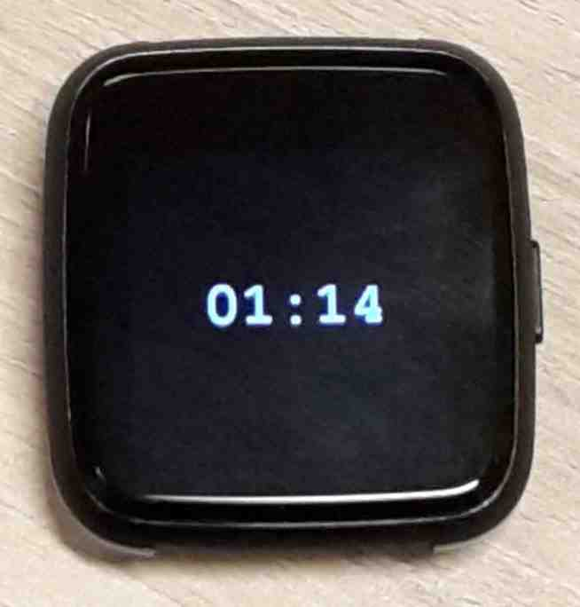
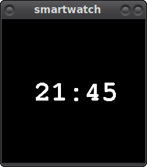

# Go smartwatch toolkit

This is an attempt to build a toolkit for developing smartwatch firmware in Go
(using [TinyGo](https://tinygo.org/)).

Supported smartwatches:

  * [PineTime](https://wiki.pine64.org/index.php/PineTime) (display, battery)
  * [X9 Pro](https://github.com/curtpw/nRF5x-device-reverse-engineering) (display)
  * Desktop Linux (for simulation)

Supported features:

  * Display.
  * Battery charge indication. Not yet properly calibrated.

This repository contains some example firmwares that run on all devices that
have all relevant features implemented:

  * [`examples/hello`](./examples/hello) draws a yellow rectangle and some text,
    for quick testing of the smartwatch.
  * [`examples/battery`](./examples/battery) shows the current battery charge
    estimation and additionally also draws the voltage on the screen.
  * [`examples/digitalclock`](./examples/digitalclock) shows a very basic
    digital clock. It draws the current hour/minute on the screen. The time may
    be incorrect as TinyGo does not currently support setting the time on
    bare-metal systems.

## Running on a real smartwatch

You can flash one of the examples to a real smartwatch. For example, to run the
digital clock example on a PineTime:

    tinygo flash -target=pinetime-devkit0 github.com/aykevl/go-smartwatch/examples/digitalclock

## Linux simulation

All features of this toolkit have been implemented for Linux as well, returning
something that at least looks legitimate. This allows for quick edit/test cycles
using `go run`. For example:

    go run github.com/aykevl/go-smartwatch/examples/digitalclock

## License

This toolkit has been licensed under the BSD 2-clause license.
